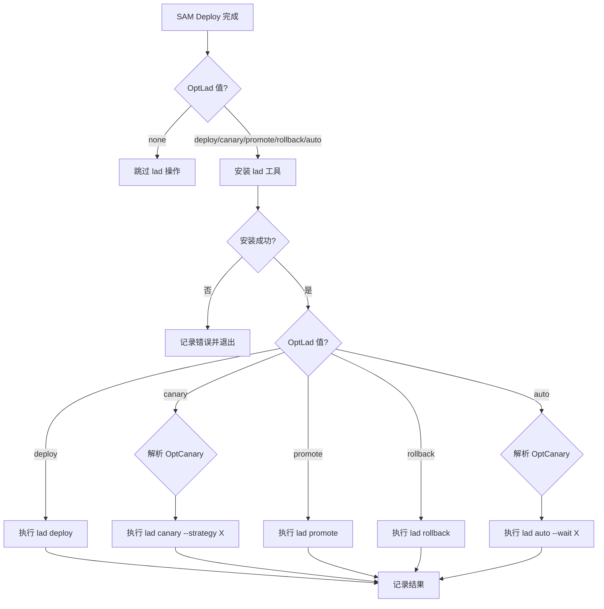
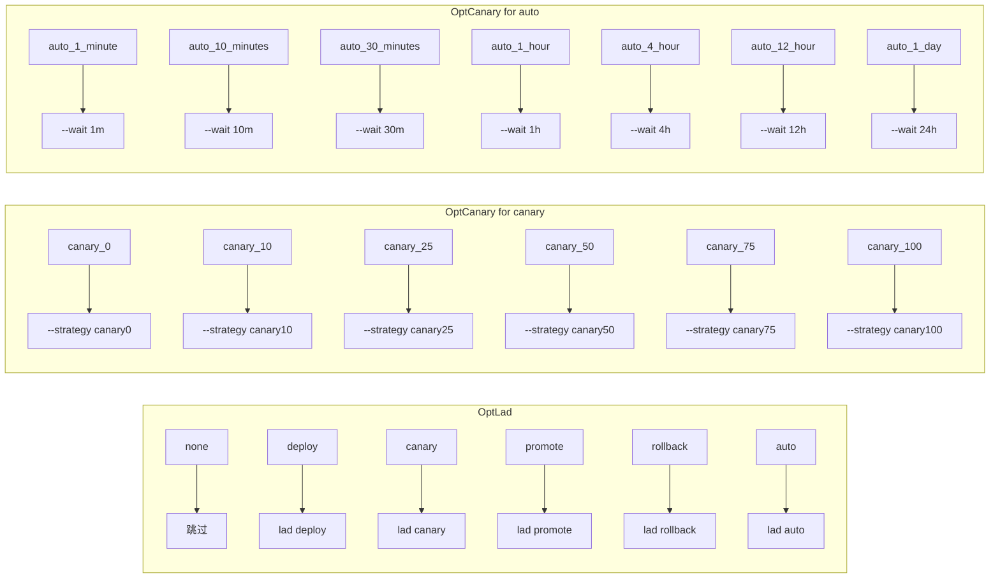

# Design Document: lad Buildspec Integration

## Overview

本设计文档描述了如何在 flow 工程的 `lambda.buildspec.yaml` 中集成 lad (Lambda Alias Deployment) 工具。通过添加 `OptLad` 和 `OptCanary` 两个环境变量参数，实现在 CodeBuild 构建流程中执行灰度发布操作。

### 设计目标

1. 在现有 buildspec 的 build 阶段，SAM deploy 之后添加 lad 操作
2. 支持多种 lad 操作模式：none、deploy、canary、promote、rollback、auto
3. 支持灵活的灰度策略配置
4. 保持与现有构建流程的兼容性

## Architecture

### 整体流程



### 参数映射



## Components and Interfaces

### 1. 环境变量参数

在 buildspec 文件头部注释中添加新参数说明：

```yaml
#  Opt参数:
#    - OptProcedure: Dynamic Procedure 名称
#    - OptComponent: Lambda 组件名
#    - OptRuntime: Lambda 运行时
#    - OptLad: lad 操作模式 (none|deploy|canary|promote|rollback|auto)
#    - OptCanary: 灰度策略 (canary_X 或 auto_X)
```

### 2. lad 工具安装脚本

```bash
# 安装 lad 工具
install_lad() {
    echo "安装 lad 工具..."
    go install github.com/aura-studio/lambda-alias-deployment@latest
    if ! command -v lad &> /dev/null; then
        echo "❌ lad 安装失败"
        exit 1
    fi
    lad --help > /dev/null
    echo "✅ lad 安装成功"
}
```

### 3. OptCanary 解析函数

```bash
# 解析 OptCanary 为 lad canary 策略
parse_canary_strategy() {
    case "$OptCanary" in
        canary_0)   echo "canary0" ;;
        canary_10)  echo "canary10" ;;
        canary_25)  echo "canary25" ;;
        canary_50)  echo "canary50" ;;
        canary_75)  echo "canary75" ;;
        canary_100) echo "canary100" ;;
        *)          echo "" ;;
    esac
}

# 解析 OptCanary 为 lad auto 等待时间
parse_auto_wait() {
    case "$OptCanary" in
        auto_1_minute)   echo "1m" ;;
        auto_10_minutes) echo "10m" ;;
        auto_30_minutes) echo "30m" ;;
        auto_1_hour)     echo "1h" ;;
        auto_4_hour)     echo "4h" ;;
        auto_12_hour)    echo "12h" ;;
        auto_1_day)      echo "24h" ;;
        *)               echo "" ;;
    esac
}
```

### 4. lad 命令执行逻辑

```bash
# 执行 lad 操作
execute_lad() {
    local lad_env="$1"
    local function_name="$2"
    
    case "$OptLad" in
        none)
            echo "OptLad=none，跳过 lad 操作"
            return 0
            ;;
        deploy)
            echo "执行 lad deploy..."
            lad deploy --env "$lad_env" --function "$function_name"
            ;;
        canary)
            local strategy=$(parse_canary_strategy)
            if [ -z "$strategy" ]; then
                echo "❌ 无效的 OptCanary 值: $OptCanary"
                exit 1
            fi
            echo "执行 lad canary --strategy $strategy..."
            lad canary --env "$lad_env" --function "$function_name" --strategy "$strategy"
            ;;
        promote)
            echo "执行 lad promote..."
            lad promote --env "$lad_env" --function "$function_name"
            ;;
        rollback)
            echo "执行 lad rollback..."
            lad rollback --env "$lad_env" --function "$function_name"
            ;;
        auto)
            local wait_time=$(parse_auto_wait)
            if [ -z "$wait_time" ]; then
                echo "❌ 无效的 OptCanary 值: $OptCanary"
                exit 1
            fi
            echo "执行 lad auto --wait $wait_time..."
            lad auto --env "$lad_env" --function "$function_name" --wait "$wait_time"
            ;;
        *)
            echo "❌ 无效的 OptLad 值: $OptLad，跳过 lad 操作"
            return 0
            ;;
    esac
}
```

## Data Models

### OptLad 参数值

| 值 | 描述 | lad 命令 |
|---|---|---|
| none | 不执行 lad 操作 | - |
| deploy | 部署新版本 | `lad deploy` |
| canary | 灰度发布 | `lad canary --strategy X` |
| promote | 完成发布 | `lad promote` |
| rollback | 回退 | `lad rollback` |
| auto | 自动递进灰度 | `lad auto --wait X` |

### OptCanary 参数值（用于 canary 模式）

| 值 | 描述 | 策略参数 |
|---|---|---|
| canary_0 | 清除灰度配置 | `--strategy canary0` |
| canary_10 | 10% 流量到新版本 | `--strategy canary10` |
| canary_25 | 25% 流量到新版本 | `--strategy canary25` |
| canary_50 | 50% 流量到新版本 | `--strategy canary50` |
| canary_75 | 75% 流量到新版本 | `--strategy canary75` |
| canary_100 | 100% 流量到新版本 | `--strategy canary100` |

### OptCanary 参数值（用于 auto 模式）

| 值 | 描述 | 等待参数 |
|---|---|---|
| auto_1_minute | 每阶段等待 1 分钟 | `--wait 1m` |
| auto_10_minutes | 每阶段等待 10 分钟 | `--wait 10m` |
| auto_30_minutes | 每阶段等待 30 分钟 | `--wait 30m` |
| auto_1_hour | 每阶段等待 1 小时 | `--wait 1h` |
| auto_4_hour | 每阶段等待 4 小时 | `--wait 4h` |
| auto_12_hour | 每阶段等待 12 小时 | `--wait 12h` |
| auto_1_day | 每阶段等待 1 天 | `--wait 24h` |


## Correctness Properties

*A property is a characteristic or behavior that should hold true across all valid executions of a system—essentially, a formal statement about what the system should do. Properties serve as the bridge between human-readable specifications and machine-verifiable correctness guarantees.*

### Property 1: Canary Strategy Mapping

*For any* valid canary strategy value in OptCanary (canary_0, canary_10, canary_25, canary_50, canary_75, canary_100), when OptLad is "canary", the buildspec SHALL construct a lad canary command with the correctly mapped `--strategy` parameter.

**Validates: Requirements 1.3, 2.1, 2.2, 2.3, 2.4, 2.5, 2.6**

### Property 2: Auto Wait Time Mapping

*For any* valid auto strategy value in OptCanary (auto_1_minute, auto_10_minutes, auto_30_minutes, auto_1_hour, auto_4_hour, auto_12_hour, auto_1_day), when OptLad is "auto", the buildspec SHALL construct a lad auto command with the correctly mapped `--wait` parameter.

**Validates: Requirements 1.6, 2.7, 2.8, 2.9, 2.10, 2.11, 2.12, 2.13**

### Property 3: Invalid Parameter Error Handling

*For any* invalid OptLad value or invalid OptCanary value (when OptLad requires it), the buildspec SHALL log a descriptive error message and either skip lad operations or exit with non-zero status.

**Validates: Requirements 1.7, 2.14, 2.15, 5.4**

### Property 4: Environment Parameter Mapping

*For any* OptRuntime value, the buildspec SHALL correctly map it to the `--env` parameter for lad commands (test or prod).

**Validates: Requirements 4.3**

## Error Handling

### 1. lad 安装失败

```bash
if ! go install github.com/aura-studio/lambda-alias-deployment@latest; then
    echo "❌ lad 工具安装失败"
    exit 1
fi
```

### 2. 无效的 OptLad 值

```bash
case "$OptLad" in
    none|deploy|canary|promote|rollback|auto)
        # 有效值，继续执行
        ;;
    *)
        echo "⚠️ 无效的 OptLad 值: $OptLad，跳过 lad 操作"
        # 不退出，只是跳过
        ;;
esac
```

### 3. 无效的 OptCanary 值

```bash
# 对于 canary 模式
if [ "$OptLad" = "canary" ]; then
    strategy=$(parse_canary_strategy)
    if [ -z "$strategy" ]; then
        echo "❌ 无效的 OptCanary 值: $OptCanary，有效值为: canary_0, canary_10, canary_25, canary_50, canary_75, canary_100"
        exit 1
    fi
fi

# 对于 auto 模式
if [ "$OptLad" = "auto" ]; then
    wait_time=$(parse_auto_wait)
    if [ -z "$wait_time" ]; then
        echo "❌ 无效的 OptCanary 值: $OptCanary，有效值为: auto_1_minute, auto_10_minutes, auto_30_minutes, auto_1_hour, auto_4_hour, auto_12_hour, auto_1_day"
        exit 1
    fi
fi
```

### 4. lad 命令执行失败

```bash
if ! lad "$command" --env "$lad_env" --function "$function_name" $extra_args; then
    echo "❌ lad $command 执行失败"
    exit 1
fi
```

## Testing Strategy

### 单元测试

由于 buildspec 是 YAML 配置文件，主要通过以下方式验证：

1. **语法验证**: 使用 YAML lint 工具验证文件语法
2. **手动测试**: 在测试环境中执行完整构建流程
3. **参数组合测试**: 测试各种 OptLad 和 OptCanary 组合

### 测试用例

| OptLad | OptCanary | 预期行为 |
|--------|-----------|----------|
| none | - | 跳过 lad 操作 |
| deploy | - | 执行 `lad deploy` |
| canary | canary_10 | 执行 `lad canary --strategy canary10` |
| canary | canary_50 | 执行 `lad canary --strategy canary50` |
| canary | invalid | 报错并退出 |
| promote | - | 执行 `lad promote` |
| rollback | - | 执行 `lad rollback` |
| auto | auto_1_minute | 执行 `lad auto --wait 1m` |
| auto | auto_1_hour | 执行 `lad auto --wait 1h` |
| auto | invalid | 报错并退出 |
| invalid | - | 跳过 lad 操作 |

### 集成测试

1. 在测试 Lambda 函数上执行完整的灰度发布流程
2. 验证版本和别名的正确更新
3. 验证流量分配的正确性
