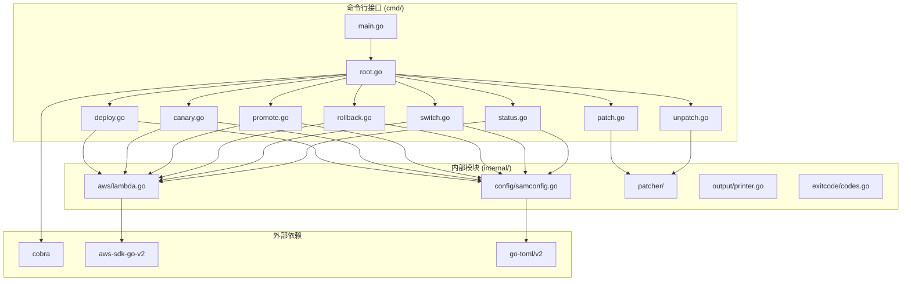
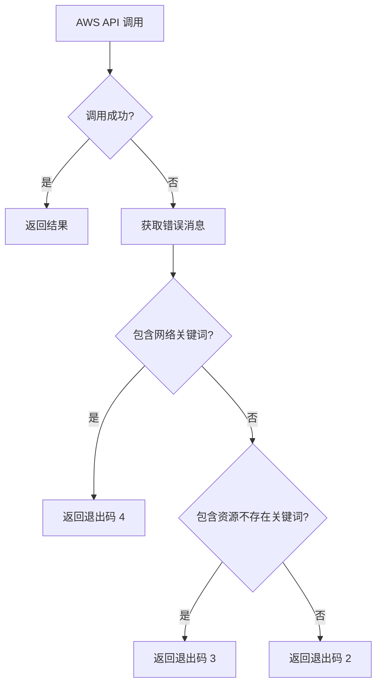

# 设计文档

## 概述

本文档描述 `lad` (Lambda Alias Deployment) 命令行工具的技术设计。该工具是 `deploy.sh` 脚本的 Go 语言直接翻译，保持相同的功能和行为。

### 技术栈

- **语言**: Go 1.21+
- **CLI 框架**: [cobra](https://github.com/spf13/cobra) - 业界标准的 Go CLI 框架
- **AWS SDK**: [aws-sdk-go-v2](https://github.com/aws/aws-sdk-go-v2) - AWS 官方 Go SDK
- **TOML 解析**: [pelletier/go-toml/v2](https://github.com/pelletier/go-toml) - TOML 解析库

## 架构

### 项目结构

```
lambda-alias-deployment/
├── go.mod                    # Go 模块定义
├── go.sum                    # 依赖锁定
├── main.go                   # 程序入口
├── cmd/                      # 命令实现
│   ├── root.go              # 根命令和通用选项
│   ├── deploy.go            # deploy 命令
│   ├── canary.go            # canary 命令
│   ├── promote.go           # promote 命令
│   ├── rollback.go          # rollback 命令
│   ├── switch.go            # switch 命令
│   ├── status.go            # status 命令
│   ├── patch.go             # patch 命令
│   └── unpatch.go           # unpatch 命令
└── internal/
    ├── aws/                 # AWS 客户端封装
    │   └── lambda.go        # Lambda API 封装
    ├── config/              # 配置检测
    │   └── samconfig.go     # samconfig.toml 解析
    ├── patcher/             # 模板补丁工具
    │   ├── patch.go         # patch 逻辑
    │   └── unpatch.go       # unpatch 逻辑
    ├── output/              # 输出格式化
    │   └── printer.go       # 信息输出工具
    └── exitcode/            # 退出码定义
        └── codes.go         # 退出码常量
```

### 架构图



## 组件和接口

### 1. 退出码定义 (internal/exitcode/codes.go)

```go
package exitcode

const (
    Success          = 0  // 成功
    ParamError       = 1  // 参数错误
    AWSError         = 2  // AWS 错误
    ResourceNotFound = 3  // 资源不存在
    NetworkError     = 4  // 网络错误
)
```

### 2. 输出工具 (internal/output/printer.go)

```go
package output

// Info 输出普通信息到 stdout
func Info(format string, args ...interface{})

// Error 输出错误信息到 stderr，格式为"错误: {message}"
func Error(format string, args ...interface{})

// Success 输出成功标记 "✓ {message}"
func Success(format string, args ...interface{})

// Warning 输出警告信息 "⚠ {message}"
func Warning(format string, args ...interface{})

// Separator 输出分隔线 "=========================================="
func Separator()
```

### 3. SAM 配置解析 (internal/config/samconfig.go)

```go
package config

// SAMConfig 表示 samconfig.toml 的结构
type SAMConfig struct {
    Default struct {
        Deploy struct {
            Parameters struct {
                StackName string `toml:"stack_name"`
                Profile   string `toml:"profile"`
            } `toml:"parameters"`
        } `toml:"deploy"`
    } `toml:"default"`
}

// LoadSAMConfig 加载 samconfig.toml 文件
func LoadSAMConfig(path string) (*SAMConfig, error)

// GetStackName 获取 stack_name
func (c *SAMConfig) GetStackName() string

// GetProfile 获取 AWS profile
func (c *SAMConfig) GetProfile() string

// GetFunctionName 根据 stack_name 和环境生成函数名
// 格式: {stack_name}-{env}-function-default
func (c *SAMConfig) GetFunctionName(env string) string
```

### 4. AWS Lambda 客户端 (internal/aws/lambda.go)

```go
package aws

import (
    "context"
    "github.com/aws/aws-sdk-go-v2/service/lambda"
)

// Client 封装 Lambda API 操作
type Client struct {
    client *lambda.Client
}

// NewClient 创建新的 Lambda 客户端
func NewClient(ctx context.Context, profile string) (*Client, error)

// CreateVersion 创建新版本
// 返回: 版本号, 错误
func (c *Client) CreateVersion(ctx context.Context, functionName, description string) (string, error)

// GetAliasVersion 获取别名指向的版本
// 返回: 版本号, 退出码
func (c *Client) GetAliasVersion(ctx context.Context, functionName, aliasName string) (string, int)

// UpdateAlias 更新别名指向（清除路由配置）
// 返回: 退出码
func (c *Client) UpdateAlias(ctx context.Context, functionName, aliasName, version string) int

// ConfigureCanary 配置灰度流量
// 参数: functionName, aliasName, mainVersion, canaryVersion, weight (0.0-1.0)
// 返回: 退出码
func (c *Client) ConfigureCanary(ctx context.Context, functionName, aliasName, mainVersion, canaryVersion string, weight float64) int

// CheckCanaryActive 检查是否有活跃的灰度配置
// 返回: 是否活跃, 灰度版本, 权重
func (c *Client) CheckCanaryActive(ctx context.Context, functionName, aliasName string) (bool, string, float64)

// VerifyVersionExists 验证版本是否存在
// 返回: 退出码
func (c *Client) VerifyVersionExists(ctx context.Context, functionName, version string) int

// classifyError 根据错误信息分类返回退出码
// 网络错误关键词: unable to locate credentials, could not connect, connection refused, network, timeout, timed out, unreachable
// 资源不存在关键词: resourcenotfoundexception, does not exist, not found, cannot find
func classifyError(err error) int
```

### 5. 模板补丁工具 (internal/patcher/)

#### patch.go

```go
package patcher

const (
    PatchStartMarker = "# >>>>>> DEPLOY_SCRIPT_PATCH_START <<<<<<"
    PatchEndMarker   = "# >>>>>> DEPLOY_SCRIPT_PATCH_END <<<<<<"
)

// PatchOptions patch 命令选项
type PatchOptions struct {
    TemplatePath string  // 模板文件路径，默认 template.yaml
    FunctionName string  // 函数资源名称，默认 Function
    DryRun       bool    // 仅预览，不实际修改
}

// Patch 执行补丁操作
func Patch(opts PatchOptions) error

// ValidateTemplate 验证模板文件
// 检查: 文件存在、包含 AWS::Serverless、包含 Resources
func ValidateTemplate(path string) error

// HasPatchMarker 检查是否存在补丁标记
func HasPatchMarker(content string) bool

// HasAliasResources 检查是否存在版本/别名资源
func HasAliasResources(content string) bool

// GetExistingAliasResources 获取已存在的别名资源列表
func GetExistingAliasResources(content string) []string

// CheckFunctionExists 检查函数资源是否存在
func CheckFunctionExists(content, functionName string) bool

// CheckDescriptionParam 检查 Description 参数是否存在
func CheckDescriptionParam(content string) bool

// DetectHttpApis 检测 HttpApi 资源
func DetectHttpApis(content string) []string

// DetectSchedules 检测 Schedule 资源
func DetectSchedules(content string) []string

// DetectScheduleRoles 检测 Schedule 相关的 IAM Role
func DetectScheduleRoles(content string) []string

// GeneratePatchContent 生成补丁内容
func GeneratePatchContent(functionName string) string

// GenerateDescriptionParam 生成 Description 参数
func GenerateDescriptionParam() string

// GenerateHttpApiPatch 生成 HttpApi 相关补丁
func GenerateHttpApiPatch(functionName, apiName string) string

// BackupFile 备份文件，返回备份文件路径
// 格式: {path}.bak.{timestamp}
func BackupFile(path string) (string, error)
```

#### unpatch.go

```go
package patcher

// UnpatchOptions unpatch 命令选项
type UnpatchOptions struct {
    TemplatePath string  // 模板文件路径，默认 template.yaml
    DryRun       bool    // 仅预览，不实际修改
    Force        bool    // 强制移除（即使无标记）
}

// Unpatch 执行移除补丁操作
func Unpatch(opts UnpatchOptions) error

// RemovePatchMarkerContent 移除标记之间的内容
func RemovePatchMarkerContent(content string) string

// RemoveAliasResources 移除版本/别名资源
func RemoveAliasResources(content string, resources []string) string
```

### 6. 根命令 (cmd/root.go)

```go
package cmd

import (
    "github.com/spf13/cobra"
)

var (
    // 全局选项
    env      string  // 环境 (test/prod)，默认 test
    profile  string  // AWS Profile
    function string  // Lambda 函数名
)

var rootCmd = &cobra.Command{
    Use:   "lad",
    Short: "Lambda Alias Deployment - Lambda 函数灰度发布工具",
}

func init() {
    rootCmd.PersistentFlags().StringVar(&env, "env", "test", "指定环境 (test|prod)")
    rootCmd.PersistentFlags().StringVar(&profile, "profile", "", "AWS Profile 名称")
    rootCmd.PersistentFlags().StringVar(&function, "function", "", "Lambda 函数名称")
}

// Execute 执行根命令
func Execute() error

// ValidateEnv 验证环境参数
func ValidateEnv(env string) error

// GetFunctionName 获取函数名
// 优先级: --function > samconfig.toml
func GetFunctionName(env string) (string, error)

// GetProfile 获取 AWS Profile
// 优先级: --profile > samconfig.toml
func GetProfile() string
```

## 数据模型

### 1. 灰度策略

```go
// CanaryStrategy 灰度策略
type CanaryStrategy string

const (
    Canary10 CanaryStrategy = "canary10"
    Canary25 CanaryStrategy = "canary25"
    Canary50 CanaryStrategy = "canary50"
    Canary75 CanaryStrategy = "canary75"
)

// Weight 返回策略对应的权重
func (s CanaryStrategy) Weight() float64 {
    switch s {
    case Canary10:
        return 0.10
    case Canary25:
        return 0.25
    case Canary50:
        return 0.50
    case Canary75:
        return 0.75
    default:
        return 0
    }
}

// IsValid 验证策略是否有效
func (s CanaryStrategy) IsValid() bool

// NextStrategy 返回下一个策略
func (s CanaryStrategy) NextStrategy() CanaryStrategy
```

### 2. 别名状态

```go
// AliasStatus 别名状态信息
type AliasStatus struct {
    Live     string  // live 别名版本
    Previous string  // previous 别名版本
    Latest   string  // latest 别名版本
    
    // 灰度配置
    CanaryActive  bool    // 是否有活跃灰度
    CanaryVersion string  // 灰度版本
    CanaryWeight  float64 // 灰度权重
}
```

### 3. 回退日志

```go
// RollbackLog 回退日志条目
type RollbackLog struct {
    Timestamp   time.Time
    Env         string
    FromVersion string
    ToVersion   string
    Reason      string
    Operator    string  // 从 USER 环境变量获取
}

// Format 格式化日志条目
// 格式: [timestamp] ENV=env FROM_VERSION=from TO_VERSION=to REASON="reason" OPERATOR=operator
func (l *RollbackLog) Format() string

// AppendToFile 追加到日志文件
func (l *RollbackLog) AppendToFile(path string) error
```


## 正确性属性

*正确性属性是系统在所有有效执行中应保持为真的特征或行为——本质上是关于系统应该做什么的形式化陈述。属性作为人类可读规范和机器可验证正确性保证之间的桥梁。*

### Property 1: 环境参数验证

*For any* 环境参数值，如果值为 "test" 或 "prod"，则应被接受；否则应返回参数错误（退出码 1）并显示有效值列表。

**Validates: Requirements 2.1, 2.3**

### Property 2: SAMConfig 解析

*For any* 有效的 samconfig.toml 文件，解析后应能正确提取 stack_name 和 profile 配置，并根据 stack_name 和环境参数生成正确格式的函数名。

**Validates: Requirements 3.1, 3.2, 3.5, 13.2**

### Property 3: 灰度策略验证

*For any* 灰度策略字符串，如果值为 canary10/canary25/canary50/canary75 之一，则应返回对应的权重（0.10/0.25/0.50/0.75）；否则应返回参数错误并显示有效策略列表。

**Validates: Requirements 5.2, 5.3**

### Property 4: auto-promote 参数验证

*For any* canary 命令执行，如果指定了 --auto-promote 但策略不是 canary75，则应返回参数错误。

**Validates: Requirements 5.8**

### Property 5: 回退日志格式

*For any* 回退操作，生成的日志条目应包含时间戳、环境、原版本、目标版本、原因和操作人，格式为 `[timestamp] ENV=env FROM_VERSION=from TO_VERSION=to REASON="reason" OPERATOR=operator`。

**Validates: Requirements 7.4, 7.5**

### Property 6: 模板验证

*For any* 模板文件，验证应检查：文件存在、包含 AWS::Serverless、包含 Resources 部分。不满足任一条件应返回参数错误。

**Validates: Requirements 10.2**

### Property 7: 补丁内容生成

*For any* 有效的函数资源名称，生成的补丁内容应包含 Lambda Version 资源和三个 Alias 资源（live、previous、latest），且使用正确的补丁标记包裹。

**Validates: Requirements 10.8**

### Property 8: 移除补丁标记内容

*For any* 包含补丁标记的模板内容，移除操作应删除标记之间的所有内容（包括标记本身），保留其他内容不变。

**Validates: Requirements 11.3**

### Property 9: 错误分类和退出码

*For any* AWS API 错误，应根据错误消息中的关键词正确分类：网络相关关键词返回退出码 4，资源不存在关键词返回退出码 3，其他返回退出码 2。

**Validates: Requirements 12.1**

### Property 10: 输出流分离

*For any* 命令执行，错误信息应输出到 stderr（格式为"错误: {message}"），正常信息应输出到 stdout。

**Validates: Requirements 12.5, 12.6**

## 错误处理

### 退出码定义

| 退出码 | 含义 | 触发场景 |
|--------|------|----------|
| 0 | 成功 | 命令正常完成 |
| 1 | 参数错误 | 无效的环境值、缺少必需参数、无效的策略等 |
| 2 | AWS 错误 | AWS API 调用失败（非网络、非资源不存在） |
| 3 | 资源不存在 | Lambda 函数或别名不存在 |
| 4 | 网络错误 | 网络连接问题、凭证问题 |

### 错误分类关键词

**网络错误关键词**:
- unable to locate credentials
- could not connect
- connection refused
- network
- timeout
- timed out
- unreachable

**资源不存在关键词**:
- resourcenotfoundexception
- does not exist
- not found
- cannot find

### 错误处理流程



## 测试策略

### 单元测试

单元测试用于验证具体示例和边界情况：

1. **配置解析测试**
   - 测试有效的 samconfig.toml 解析
   - 测试无效或缺失的配置文件处理
   - 测试函数名生成逻辑

2. **灰度策略测试**
   - 测试各策略的权重值
   - 测试无效策略的错误处理
   - 测试 NextStrategy 逻辑

3. **模板补丁测试**
   - 测试补丁内容生成
   - 测试 HttpApi 补丁生成
   - 测试补丁标记检测
   - 测试资源检测逻辑

4. **错误分类测试**
   - 测试各类错误消息的分类
   - 测试退出码返回

### 属性测试

属性测试用于验证通用属性，每个属性测试应运行至少 100 次迭代：

1. **Property 1**: 环境参数验证
   - 生成随机字符串，验证只有 "test" 和 "prod" 被接受

2. **Property 3**: 灰度策略验证
   - 生成随机策略字符串，验证有效策略返回正确权重

3. **Property 5**: 回退日志格式
   - 生成随机日志数据，验证格式正确

4. **Property 8**: 移除补丁标记内容
   - 生成包含补丁标记的随机内容，验证移除后标记内容被删除

5. **Property 9**: 错误分类
   - 生成包含各类关键词的错误消息，验证分类正确

### 集成测试

集成测试需要 mock AWS API：

1. **deploy 命令流程测试**
2. **canary 命令流程测试**
3. **promote 命令流程测试**
4. **rollback 命令流程测试**
5. **switch 命令流程测试**
6. **status 命令流程测试**

### 测试框架

- 单元测试和属性测试：Go 标准 testing 包 + [rapid](https://github.com/flyingmutant/rapid) 属性测试库
- Mock：[gomock](https://github.com/golang/mock) 或接口注入

